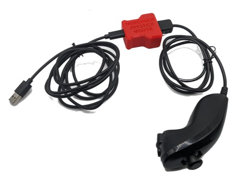

 # Ivy Nunchuck Joystick Adapter

The Ivy Nunchuck Adapter allows a Nunchuck Controller to be used as a USB HID Mouse or USB HID Gamepad. The device is comprised of off-the-shelf electronics that are assembled without the need to solder into a 3D printed enclosure. The overall cost of materials for the adapter is $20 (plus $8 for component shipping). Paired with an old Nintendo Wii Nunchuck controller or a Nunchuck Controller replacement ($10-$20), this provides a cost effective solution for an input device.

The Ivy Nunchuck Adapter is open assistive technology (OpenAT). Under the terms of the open source licenses, the device may be built, used, and improved upon by anyone.

The current version of the Ivy Nunchuck Adapter (v0.1) is a minimum viable product. 

## OpenAT Joysticks
This design is part of the [OpenAT Joystick project](https://github.com/makersmakingchange/OpenAT-Joysticks), a collection of open source designs for digital access and adapted gaming.  

## Usage
### Setup
1. Plug the Nunchuck Controller into the Ivy Nunchuck Adapter.
2. Plug the USB-C end of the USB Cable into the Ivy Nunchuck Adapter.
3. Connected the other end of the USB cable to the host device (use a suitable adapter if necessary).

### Swapping between Mouse and Gamepad Mode
1.	Reset the Adapter by pressing the Reset Button or removing and replacing the USB Cable.
2.	When the Status Light turns red, press and hold both the C Button and the Z Button on the Nunchuk.
3.	When the Status Light turns green, release the buttons. 
4.	Press the C button to toggle between modes. The light on the Adapter will indicate the current mode: USB HID Mouse - Yellow, USB HID Gamepad - Blue. 
5.	Press and release the Z button to set the mode. The light will blink.
6.	Reset the Adapter by pressing the Reset Button or removing and replacing the USB Cable.

### Mouse Mode
1. Move the joystick to control the cursor.
2. Press the C button to left click.
3. Press the Z button to right click.

### Gamepad Mode
1. Move the joystick to control the joystick.
2. Press the C button to activate Button 1.
3. Press the Z button to activate Button 2.

## How to Obtain a Ivy Nunchuck Adapter
There are several options for obtaining the device.

### 1. Do-it-Yourself (DIY) or Do-it-Together (DIT)

This is an open-source assistive technology, so anyone is free to build it. All of the files and instructions required to build the Ivy Nunchuck Adapter are contained within this repository. Refer to the Maker Guide below.

### 2. Request a build of this device

A limited number of these devices may be available at no-cost to people with disabilities that reside within Canada. If you think this applies to you, please send an email to info@makersmakingchange.com.

Once the device is finalized and published in the Makers Making Change library, it will also be possible to submit a build request to have a volunteer maker build the device. As the requestor, you are responsible for reimbursing the maker for the cost of materials and any shipping.
<!--- 
If you would like to obtain a Ivy Nunchuck Adapter, you may submit a build request through the [MMC Library Page](https://makersmakingchange.com/project/Ivy-Nunchuck-Adapter/) to have a volunteer maker build the device. As the requestor, you are responsible for reimbursing the maker for the cost of materials and any shipping.
--->
### 3. Build this device for someone else

Once the device is finalized and published in the Makers Making Change library, there is a plan to hold a number of build events in Canada. If you'd like to participate, send an email to info@makersmakingchange.com.

Once added to the library, if you have the skills and equipment to build this device, and would like to donate your time to create the device for someone who needs it, visit the [MMC Makers Wanted](https://makersmakingchange.com/maker-wanted/) section to fulfill build requests.

<!---
If you have the skills and equipment to build this device, and would like to donate your time to create the switch for someone who needs it, visit the [MMC Maker Wanted](https://makersmakingchange.com/maker-wanted/) section.
--->

## Build Instructions

### 1. Read through the Maker Guide

The Maker Guide provides an overview of how to build, program, and test the device.

### 2. Order the Off-The-Shelf Components

The [Bill of Materials](/Documentation/Ivy-Nunchuck-Joystick-Adapter_BOM.xlsx) lists all of the parts and components required to build the Ivy Nunchuck Adapter. 

### 3. Print the 3D Printable Components

Print the components for the enclosure.

All of the files and individual print files can be in the [/Build_Files/3D_Printing_Files](/Build_Files/3D_Printing/) folder.

### 4. Assemble the Ivy Nunchuck Adapter.

Reference the [Maker Guide](/Documentation/Ivy-Nunchuck-Adapter_Maker_Guide_v0.1.1.pdf) for the tools and steps required to build each portion.

## Files
### Documentation
| Document             | Version  | Link |
|----------------------|----------|------|
| Design Rationale     | 0.1      | [Ivy-Nunchuck-Joystick-Adapter_Design_Rationale](/Documentation/Ivy-Nunchuck-Joystick-Adapter_Design_Rationale.pdf)  |
| Maker Guide          | 0.1.1    | [Ivy-Nunchuck-Joystick-Adapter_Maker_Guide](/Documentation/Ivy-Nunchuck-Joystick-Adapter_Maker_Guide.pdf)          |
| Bill of Materials    | 0.1.1    | [Ivy-Nunchuck-Joystick-Adapter_Bill_of_Materials](/Documentation/Ivy-Nunchuck-Joystick-Adapter_BOM.xlsx)           |
| Bill of Materials    | 0.1.1    | [Ivy-Nunchuck-Joystick-Adapter_Bill_of_Materials](/Documentation/Ivy-Nunchuck-Joystick-Adapter_BOM.csv)            |
| User Guide           | 0.1      | [Ivy-Nunchuck-Joystick-Adapter_User_Guide](/Documentation/Ivy-Nunchuck-Joystick-Adapter_User_Guide.pdf)              |

### Design Files
 - [CAD Files](/Design_Files/CAD)

### Build Files
 - [3D Printing Files](/Build_Files/3D_Printing)

## Attribution
Several previous projects have interfaced with a Nunchuck controller to use it as a mouse or joystick including [USB Nunchuck Mouse](https://hackaday.io/project/188294-usbnunchuckmouse).

The [Adafruit QT Py](http://www.adafruit.com/products/4600) development board was designed by Limor Fried/Ladyada from Adafruit. The PCB design is [available open source](https://github.com/adafruit/Adafruit-QT-Py-PCB) under a CC-BY-SA license.

The [Adafruit Wii Nunchuck Breakout Adapter - Qwiic / STEMMA QT](https://www.adafruit.com/product/4836) board was designed by Limor Fried/Ladyada from Adafruit. The PCB design is [available open source](https://github.com/adafruit/Adafruit-Wii-Nunchuck-Breakout-Adapter-PCB)  under a CC-BY-SA license.

The 3D printed enclosure is a novel design by Jake McIvor / Makers Making Change.

The software code is based on joystick software created by Milad Hajihassan / Makers Making Change. It was adapted for the Nunchuck by Jake McIvor / Makers Making Change.

- The code utilizes the [WiiChuck](https://github.com/madhephaestus/WiiChuck) library by [Kevin Harrington (madhephaestus)](https://github.com/madhephaestus)) available under a [LGPL-3.0 license](https://www.gnu.org/licenses/lgpl-3.0.html).
 - The code also utilizes the [FlashStorage](https://github.com/cmaglie/FlashStorage) library by [Cristian Maglie (cmaglie)](https://github.com/cmaglie) available under a 
 [LGPL-2.1 license](https://www.gnu.org/licenses/lgpl-2.1.html).

## License
Copyright (c) 2023 Neil Squire / Makers Making Change.

This repository describes Open Hardware:
 - Everything needed or used to design, make, test, or prepare the Ivy Nunchuck Joystick Adapter is licensed under the [CERN 2.0 Weakly Reciprocal license (CERN-OHL-W v2) or later](https://cern.ch/cern-ohl ) .
 - All software is under the [GNU General Public License v3.0 (GPL-3.0)](https://www.gnu.org/licenses/gpl.html).
 - Accompanying material such as instruction manuals, videos, and other copyrightable works that are useful but not necessary to design, make, test, or prepare the Ivy Nunchuck Joystick Adapter are published under a [Creative Commons Attribution-ShareAlike 4.0 license (CC BY-SA 4.0)](https://creativecommons.org/licenses/by-sa/4.0/) .

You may redistribute and modify this documentation and make products using it under the terms of the [CERN-OHL-W v2](https://cern.ch/cern-ohl).
This documentation is distributed WITHOUT ANY EXPRESS OR IMPLIED WARRANTY, INCLUDING OF MERCHANTABILITY, SATISFACTORY QUALITY AND FITNESS FOR A PARTICULAR PURPOSE.
Please see the CERN-OHL-W v2 for applicable conditions.

Source Location: https://github.com/makersmakingchange/Ivy-Nunchuk-Joystick-Adapter

---

## About Makers Making Change

Makers Making Change is an initiative of [Neil Squire](https://www.neilsquire.ca/), a Canadian non-profit that uses technology, knowledge, and passion to empower people with disabilities.

Makers Making Change is committed to creating and cultivating a network of volunteer makers who support people with disabilities in their communities through cost-effective Open Assistive Technology. MMC hosts a library of free, open-source designs complete with parts lists and build instructions.

 - Website: [www.MakersMakingChange.com](https://www.makersmakingchange.com/)
 - GitHub: [https://github.com/makersmakingchange](https://github.com/makersmakingchange)
 - Twitter: [@makermakechange](https://twitter.com/makermakechange)
 - Instagram: [@makersmakingchange](https://www.instagram.com/makersmakingchange)

### Contact

For technical questions, to get involved, or share your experience we encourage you to visit the [MMC Website](https://www.makersmakingchange.com/), [MMC Forum](https://makersmakingchange.com/forum), or contact info@makersmakingchange.com
