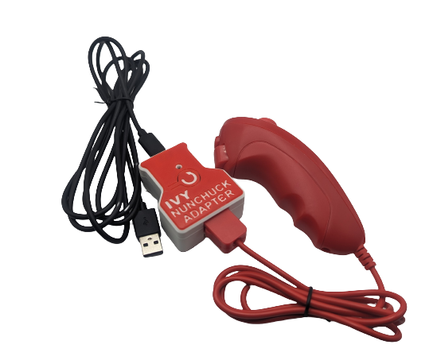

 # Ivy Nunchuck Joystick Adapter

The Ivy Nunchuck Adapter allows a Nunchuck Controller to be used as a USB HID Mouse or USB HID Gamepad. 

Commercially available Nunchuck Controllers have a thumbstick and two buttons. The thumbstick has a range of motion approximately ±30° (~±15 mm motion) and requires about 100 grams-force to fully deflect.

The device is comprised of off-the-shelf electronics that are assembled without the need to solder into a 3D printed enclosure. The overall cost of materials for the adapter is $20 (plus $8 for component shipping). Paired with an old Nintendo Wii Nunchuck controller or a Nunchuck Controller replacement ($10-$20), this provides a cost effective solution for an input device.

The Ivy Nunchuck Adapter can be used directly as a left or right thumbstick for the Microsoft Xbox Adaptive Controller (XAC) using the left or right USB ports.

The Ivy Nunchuck Adapter is open assistive technology (OpenAT). Under the terms of the open source licenses, the device may be built, used, and improved upon by anyone.

The current version of the Ivy Nunchuck Adapter (v1.0) has been built and user tested. 

MMC Assistive Device Library Listing: https://www.makersmakingchange.com/s/product/ivy-nunchuck-joystick-Adapter/01tJR0000009LBiYAM

## OpenAT Joysticks
This design is part of the [OpenAT Joystick project](https://github.com/makersmakingchange/OpenAT-Joysticks), a collection of open source designs for digital access and adapted gaming.  

## Usage
### Setup
1. Plug the Nunchuck Controller into the Ivy Nunchuck Adapter.
2. Plug the USB-C end of the USB Cable into the Ivy Nunchuck Adapter.
3. Connected the other end of the USB cable to the host device (use a suitable adapter if necessary).

### Swapping between Mouse and Gamepad Mode
1.	Reset the Adapter by pressing the Reset Button or removing and replacing the USB-C Cable.
2.	When the Status Light turns red, press and hold both the C Button and the Z Button on the Nunchuck.
3.	When the Status Light turns green, release the buttons. 
4.	Press the C button (round button) to toggle between modes. The light on the Adapter will indicate the current mode: USB HID Mouse - Yellow, USB HID Gamepad - Blue. 
5.	Press and release the Z button (square button) to set the mode. The light will blink in the colour of the selected mode.
6.	Reset the Adapter by pressing the Reset Button or removing and replacing the USB-C Cable.

### Mouse Mode
1. Move the joystick to control the cursor.
2. Press the C button to left click.
3. Press the Z button to right click.

### Gamepad Mode
1. Move the joystick to control the joystick.
2. Press the C button to activate Button 1.
3. Press the Z button to activate Button 2.

## How to Obtain a Ivy Nunchuck Adapter
There are several options for obtaining the device.

### 1. Do-it-Yourself (DIY) or Do-it-Together (DIT)

This is an open-source assistive technology, so anyone is free to build it. All of the files and instructions required to build the Ivy Nunchuck Adapter are contained within this repository. Refer to the Maker Guide below.

### 2. Request a build of this device

If you would like to obtain a Ivy Nunchuck Adapter, you may submit a build request through the [MMC Assistive Device Library Listing:](https://www.makersmakingchange.com/s/product/ivy-nunchuck-joystick-Adapter/01tJR0000009LBiYAM) to have a volunteer maker build the device. As the requestor, you are responsible for reimbursing the maker for the cost of materials and any shipping.

### 3. Build this device for someone else

If you have the skills and equipment to build this device, and would like to donate your time to create the switch for someone who needs it, visit the [MMC Maker Wanted](https://makersmakingchange.com/maker-wanted/) section.

## Build Instructions

### 1. Read through the Maker Guide
The [Maker Guide](/Documentation/Ivy_Nunchuck_Adapter_Maker_Guide.pdf) provides an overview of how to build, program, and test the device.

### 2. Use Maker Checklist
Work through the Maker Checklist. Confirm details and customization options with the user.

### 3. Order the Off-The-Shelf Components
The Bill of Materials([.csv](/Documentation/Ivy_Nunchuck_Joystick_Adapter_BOM.csv))([.xls](/Documentation/Working_Documents/Ivy_Nunchuck_Joystick_Adapter_BOM.xlsx)) lists all of the parts and components required to build the device.

### 4. Print the 3D Printable Components
Print the components for the enclosure. The print files can be found in the [/Build_Files/3D_Printing_Files](/Build_Files/3D_Printing/) folder. Reference the 3D Printing Guide section in the [Maker Guide](/Documentation/Ivy_Nunchuck_Adapter_Maker_Guide.pdf).

### 5. Assemble the Ivy Nunchuck Adapter.
Reference the Assembly Guide section of the [Maker Guide](/Documentation/Ivy_Nunchuck_Adapter_Maker_Guide.pdf) for the tools and steps required to assemble the device.

### 6. Flash the Ivy Nunchuck Adapter Firmware.
Reference the [Maker Guide](/Documentation/Ivy_Nunchuck_Adapter_Maker_Guide.pdf) for step-by-step instructions. The firmware is located in the [/Build_Files/Firmware_Files](/Build_Files/Firmware_Files/) folder.

## Files
### Documentation
| Document             | Version  | Link |
|----------------------|----------|------|
| Design Rationale     | 1.0      | [Ivy_Nunchuck_Joystick_Adapter_Design_Rationale](/Documentation/Ivy_Nunchuck_Joystick_Adapter_Design_Rationale.pdf)  |
| Maker Guide          | 1.1      | [Ivy_Nunchuck_Joystick_Adapter_Maker_Guide](/Documentation/Ivy_Nunchuck_Joystick_Adapter_Maker_Guide.pdf)          |
| Bill of Materials    | 1.0      | [Ivy_Nunchuck_Joystick_Adapter_Bill_of_Materials](/Documentation/Ivy_Nunchuck_Joystick-Adapter_BOM.csv)            |
| User Guide           | 1.0      | [Ivy_Nunchuck_Joystick_Adapter_User_Guide](/Documentation/Ivy_Nunchuck_Joystick_Adapter_User_Guide.pdf)              |

### Design Files
 - [CAD_Files](/Design_Files/CAD_Files)

### Build Files
 - [3D_Printing_Files](/Build_Files/3D_Printing_Files)
 - [Firmware_Files](/Build_Files/Firmware_Files/)

## License
Copyright (c) 2023-2025 Neil Squire / Makers Making Change.

This repository describes Open Hardware:
 - Everything needed or used to design, make, test, or prepare the Ivy Nunchuck Joystick Adapter is licensed under the [CERN 2.0 Weakly Reciprocal license (CERN-OHL-W v2) or later](https://cern.ch/cern-ohl ) .
 - All software is under the [GNU General Public License v3.0 (GPL-3.0)](https://www.gnu.org/licenses/gpl.html).
 - Accompanying material such as instruction manuals, videos, and other copyrightable works that are useful but not necessary to design, make, test, or prepare the Ivy Nunchuck Joystick Adapter are published under a [Creative Commons Attribution-ShareAlike 4.0 license (CC BY-SA 4.0)](https://creativecommons.org/licenses/by-sa/4.0/) .

You may redistribute and modify this documentation and make products using it under the terms of the [CERN-OHL-W v2](https://cern.ch/cern-ohl).
This documentation is distributed WITHOUT ANY EXPRESS OR IMPLIED WARRANTY, INCLUDING OF MERCHANTABILITY, SATISFACTORY QUALITY AND FITNESS FOR A PARTICULAR PURPOSE.
Please see the CERN-OHL-W v2 for applicable conditions.

Source Location: https://github.com/makersmakingchange/Ivy-Nunchuk-Joystick-Adapter

## Attribution
Several previous projects have interfaced with a Nunchuck controller to use it as a mouse or joystick including [USB Nunchuck Mouse](https://hackaday.io/project/188294-usbnunchuckmouse).

The [Adafruit QT Py](http://www.adafruit.com/products/4600) development board was designed by Limor Fried/Ladyada from Adafruit. The PCB design is [available open source](https://github.com/adafruit/Adafruit-QT-Py-PCB) under a CC-BY-SA license.

The [Adafruit Wii Nunchuck Breakout Adapter - Qwiic / STEMMA QT](https://www.adafruit.com/product/4836) board was designed by Limor Fried/Ladyada from Adafruit. The PCB design is [available open source](https://github.com/adafruit/Adafruit-Wii-Nunchuck-Breakout-Adapter-PCB)  under a CC-BY-SA license.

- The code utilizes the [WiiChuck](https://github.com/madhephaestus/WiiChuck) library by [Kevin Harrington (madhephaestus)](https://github.com/madhephaestus)) available under a [LGPL-3.0 license](https://www.gnu.org/licenses/lgpl-3.0.html).
 - The code also utilizes the [FlashStorage](https://github.com/cmaglie/FlashStorage) library by [Cristian Maglie (cmaglie)](https://github.com/cmaglie) available under a 
 [LGPL-2.1 license](https://www.gnu.org/licenses/lgpl-2.1.html).

 ### Contributors
- Jake McIvor, Neil Squire Society. Enclosure design, documentation, coding, testing,
- Milad Ha, Neil Squire Society. Coding.
- Josie Versloot, Neil Squire Society. Coding, testing.
- Stephen Moyer, Neil Squire Society. Testing.
- Tyler Fentie, Neil Squire Society. Testing.

---

<!-- ABOUT MMC START -->
## About Makers Making Change

Makers Making Change is a program of [Neil Squire](https://www.neilsquire.ca/), a Canadian non-profit that uses technology, knowledge, and passion to empower people with disabilities.

Makers Making Change leverages the capacity of community based Makers, Disability Professionals and Volunteers to develop and deliver affordable Open Source Assistive Technologies.

 - Website: [www.MakersMakingChange.com](https://www.makersmakingchange.com/)
 - GitHub: [makersmakingchange](https://github.com/makersmakingchange)
 - Bluesky: [@makersmakingchange.bsky.social](https://bsky.app/profile/makersmakingchange.bsky.social)
 - Instagram: [@makersmakingchange](https://www.instagram.com/makersmakingchange)
 - Facebook: [makersmakechange](https://www.facebook.com/makersmakechange)
 - LinkedIn: [Neil Squire Society](https://www.linkedin.com/company/neil-squire-society/)
 - Thingiverse: [makersmakingchange](https://www.thingiverse.com/makersmakingchange/about)
 - Printables: [MakersMakingChange](https://www.printables.com/@MakersMakingChange)

### Contact Us
For technical questions, to get involved, or to share your experience we encourage you to [visit our website](https://www.makersmakingchange.com/) or [contact us](https://www.makersmakingchange.com/s/contact).
<!-- ABOUT MMC END -->
